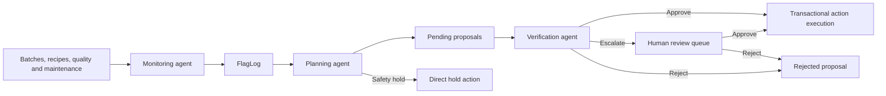

# Ontology-backed manufacturing agents

**Personal project · Manufacturing operations prototype**

A TypeScript application that connects manufacturing data, AI agent decisions, and operational actions through a shared ontology. It models batches, equipment, recipes, quality tests, and maintenance records so agents can investigate production issues, propose interventions, and submit decisions through an auditable execution path.

The project combines a PostgreSQL-backed ontology API, six role-specific agents, and a React application for investigation and proposal review. Its main engineering focus is controlling how AI recommendations become changes to operational data.

## Engineering highlights

- **Metadata-driven ontology:** Built reusable object queries, relationship traversal, and schema-validated business actions with TypeScript, PostgreSQL, and Hono. Public object and property names resolve through a metadata catalog rather than separate endpoints for every entity.
- **Codex runtime and custom MCP bridge:** Reimplemented the agent runtime using the OpenAI Codex SDK and a stdio MCP bridge, with explicit tool allowlists across six manufacturing agent roles.
- **Transactional proposal approval:** Reworked approval so business mutations, review decisions, and audit writes share one PostgreSQL transaction. Row locks and current-state checks guard against competing decisions and partial commits.
- **Human review interface:** Implemented a React queue for pending and escalated proposals, including rationale, parameters, escalation reasons, and reviewer feedback that the supply-disruption agent can retrieve in subsequent runs.
- **Observability and automated tests:** Added OpenTelemetry/Langfuse tracing for model and tool execution, plus tests for tool restrictions, caller attribution, error handling, review API contracts, and PostgreSQL transaction behavior.

## Manufacturing workflow

A fermentation concern depends on more than a single measurement. The agents can combine a batch's sugar level and fermentation day with its recipe targets, quality tests, assigned tank, maintenance history, and operator notes.

The implemented workflow separates observation, intervention planning, and verification:

1. **Monitor:** Inspect fermenting batches and record supported concerns as `FlagLog` objects.
2. **Plan:** Review open flags and propose additional rest or an earlier transfer schedule. The planner can also place an eligible batch on hold directly for a supported safety-stop concern.
3. **Verify:** Check each pending proposal against the underlying evidence. Approve supported proposals, reject clearly invalid ones, or escalate unresolved assumptions for human review.
4. **Review:** Let a person approve or reject pending and escalated proposals, with a decision note.
5. **Execute and audit:** Apply the approved business action and persist the review decision and business audit records atomically.

These are individually invoked agents. The repository does not automatically schedule or chain their runs.



## Architecture

The workspace contains three applications with separate responsibilities:

| Application | Responsibility | Main technologies |
| --- | --- | --- |
| `apps/ontology` | Metadata catalog, object APIs, validation, business actions, access and audit records | Hono, Kysely, PostgreSQL, JSON Schema |
| `apps/agents` | Agent instructions, tool selection, MCP transport, model execution, event streaming and tracing | OpenAI Codex SDK, Zod, OpenTelemetry, Langfuse |
| `apps/data-platform` | Ontology exploration, batch investigation, action forms and proposal review | React, Blueprint, Vite |

Both the browser application and agent tools use the ontology HTTP API. Agent tools do not issue SQL directly. Kysely handles runtime queries; SQL files applied through `run-sql.ts` manage schema changes.

### Ontology and action contracts

The ontology separates operational records from metadata describing how to access them:

| Catalog table | Purpose |
| --- | --- |
| `object_type` | Maps a public object type to its PostgreSQL schema and table |
| `property` | Defines property types and maps public names to storage columns |
| `link` | Describes relationships, inverse names and cardinality |
| `action_type` | Defines available actions, parameter schemas and optional caller allowlists |

For example, the public property `plannedTransferAt` maps to the storage column `planned_transfer_at`. The generic API uses those mappings for validation and queries, and resolves forward and inverse relationships when retrieving object details. The React action dialog derives its inputs from action metadata.

Domain objects include batches, tanks, packaging lines, recipes, operators, bottling runs, quality tests, maintenance logs, flags and proposals. A brewery schema extension adds site ownership for tanks and lines. Operational records generally use readable text IDs such as `T-12`; proposals use generated integer IDs.

An action needs both a metadata definition and a registered handler. The current registry contains ten actions: seven batch/tank operations and three proposal decisions. Action parameter types are derived from the JSON Schema definitions in `schema.ts`, keeping handler inputs aligned with the published contract.

Key implementation: [schema and action definitions](apps/ontology/src/schema.ts), [generic object routes](apps/ontology/src/routes/objects.ts), [action invocation](apps/ontology/src/routes/actions.ts), [handler registry](apps/ontology/src/actions/index.ts).

### Six agent roles

| Agent | Responsibility | Available operations |
| --- | --- | --- |
| Analytics | Answer operational questions using retrieved objects and cited IDs | Read only |
| Shift report | Translate a sample handover report into operational changes | Reads, direct batch deferral and tank maintenance scheduling |
| Ingredient delivery disruption | Assess affected batches and consult previous review feedback | Reads, cancellation and deferral proposals |
| Monitoring | Investigate fermentation health and record evidence-backed concerns | Reads and flag creation |
| Planning | Select interventions for open concerns | Reads, direct holds, rest-extension and early-transfer proposals |
| Verification | Assess submitted proposals without replanning them | Reads, approval, rejection and escalation |

The shared runtime loads live ontology metadata into the model's input before execution. Each run receives an isolated Codex configuration and a selected set of ontology tools. The MCP bridge checks the allowlist both when advertising tools and when dispatching calls, so guessing a disabled tool name does not grant access. Shell and web search tools are disabled in the runtime configuration.

Evidence interpretation remains model-driven. Instructions require source IDs, distinguish observations from assumptions, and direct agents to report missing evidence; those instructions are not a deterministic guarantee of correct judgment.

Key implementation: [agent runtime](apps/agents/src/run-agent.ts), [MCP bridge](apps/agents/src/tools/shared/queryObjectsMcp.ts), [live schema context](apps/agents/src/helpers/buildSchemaBlock.ts), [agent entry points](apps/agents/src/agents/manufacturing).

### Approval and transaction boundaries

A proposal stores its action type, target ID, business parameters, rationale, proposer and review state. Proposal creation does not execute the proposed action. Approval does.

The approval handler:

1. Starts a transaction and locks the proposal row.
2. Rechecks that its status is `pending` or `escalated`.
3. Resolves the stored action and validates its parameters against current metadata.
4. Locks the target object and invokes the action using the same transaction.
5. Records the approval and business audits before committing.

Inner actions join the approval transaction through a shared helper. If execution or an audit write fails, the transaction rolls back the target mutation and review updates together. Competing reviewers wait on the proposal lock and recheck its status before proceeding.

The business action is attributed to the approving caller, with the proposal ID attached to its audit parameters. Rejection and escalation record decisions without running the proposed action. Access-admission logs are written separately, before business execution, so denied attempts and admitted requests that later fail remain visible.

Key implementation: [proposal approval](apps/ontology/src/actions/shared/proposalApprove.ts), [decision locking and persistence](apps/ontology/src/actions/shared/proposalDecision.ts), [transaction helper](apps/ontology/src/actions/shared/transaction.ts), [transaction and concurrency tests](apps/ontology/src/actions/shared/proposal.integration.test.ts).

### Review experience and feedback

The React application provides an ontology manager, object explorer, batch investigation view and proposal queue. Reviewers can inspect proposed parameters and rationale, see escalation notes, and supply feedback when approving or rejecting a proposal.

The queue keeps pending and escalated proposals reviewable, prevents duplicate submissions within the current UI session, and removes a proposal only after the server confirms the decision. Failed reviews preserve the row and the reviewer's draft note.

The ingredient-delivery-disruption agent is instructed to retrieve its prior approved and rejected proposals and use decision notes as context for later decisions. This is feedback retrieval; it does not retrain the model.

Key implementation: [review queue](apps/data-platform/src/ProposalsQueue.tsx), [review API client](apps/data-platform/src/api.ts), [supply-disruption configuration](apps/agents/src/agents/manufacturing/ingredientDeliveryDisruption.config.json).

### Observability

The runtime streams execution events to a local browser viewer using Server-Sent Events. Optional Langfuse tracing captures a parent agent run, a model-turn span, tool inputs and outputs, assistant messages, token usage and errors. The tracing adapter flushes observations before shutdown and closes unfinished tool spans as failures.

Business audit records answer which operational change was made and by whom. Agent traces show the execution steps leading to a result. The local event viewer provides live visibility during a run.

Key implementation: [tracing adapter](apps/agents/src/helpers/agentTracing.ts), [event viewer](apps/agents/src/helpers/eventViewer.ts), [tracing tests](apps/agents/src/helpers/agentTracing.test.ts).

## Running locally

### Prerequisites

- Node.js 22+ with native TypeScript execution support and pnpm.
- An existing PostgreSQL/Neon development database containing the `manufacturing` ontology catalog and base operational tables.
- Codex authentication available to the SDK. The runtime can copy the existing local Codex `auth.json` into its temporary configuration directory.
- Optional Langfuse credentials for remote tracing.

The commands below assume the base database is already provisioned. `apply-action-schema` extends an existing ontology; it is not an empty-database bootstrap command.

Run commands from the repository root:

```sh
pnpm install
```

### Environment

Set these values in the root `.env`. Keep credentials local. When adding missing variables to an existing file, append them instead of replacing the file.

| Variable | Purpose |
| --- | --- |
| `DATABASE_URL` | PostgreSQL/Neon connection string |
| `ONTOLOGY_URL` | Ontology API URL; use `http://localhost:3000` for the default local setup |
| `COURSE_NOW` | Required scenario-time anchor, as an ISO datetime matching the dataset |
| `PORT` | Optional API port; defaults to `3000` |
| `LANGFUSE_PUBLIC_KEY` | Optional Langfuse public key |
| `LANGFUSE_SECRET_KEY` | Optional Langfuse secret key |
| `LANGFUSE_BASE_URL` | Optional Langfuse service URL; defaults to `https://cloud.langfuse.com` |

`COURSE_NOW` is the existing configuration name for scenario time. The API clock advances from that anchor after process startup; the browser uses the configured anchor for dashboard calculations. The agent runtime supplies both `ONTOLOGY_URL` and the read-tool alias `HONO_URL` to its MCP subprocess.

### Apply action metadata and start the applications

For an existing development ontology, apply the action definitions and supporting schema extensions:

```sh
pnpm apply-action-schema
```

This command generates temporary SQL from `schema.ts`, applies it through `pnpm run-sql` using the root `.env`, and removes the temporary file afterward.

Start the API and UI in separate terminals:

```sh
pnpm --filter @ontology/ontology dev
```

```sh
pnpm --filter @ontology/data-platform dev
```

The API defaults to `http://localhost:3000`. Open the frontend URL printed by Vite. Its development proxy targets port `3000`; changing the API port also requires updating that proxy.

### Run an agent

Start with the read-only analytics agent:

```sh
node --env-file=.env apps/agents/src/agents/manufacturing/analytics.ts \
  "Which batches are fermenting, and which quality or maintenance records are relevant? Cite object IDs."
```

The following entry points can write flags, create proposals, place holds or execute approved actions. Run them against the intended development dataset, one at a time:

```sh
node --env-file=.env apps/agents/src/agents/manufacturing/monitoring.ts
node --env-file=.env apps/agents/src/agents/manufacturing/planning.ts
node --env-file=.env apps/agents/src/agents/manufacturing/verification.ts
```

The supply-disruption agent accepts a JSON configuration containing `systemPrompt` and `prompt`:

```sh
node --env-file=.env apps/agents/src/agents/manufacturing/ingredientDeliveryDisruption.ts \
  apps/agents/src/agents/manufacturing/ingredientDeliveryDisruption.config.json
```

During a run, the event viewer is available at `http://localhost:3455`. That port is shared by all agent entry points, so the current runtime is intended for one local run at a time.

## Tests

The existing suite covers tool payload validation, MCP allowlists, caller attribution, proposal API contracts, tracing and event replay. Run the tests that replace external transports or persistence with local test doubles:

```sh
node --env-file=.env --test \
  apps/agents/src/helpers/*.test.ts \
  apps/agents/src/tools/manufacturing/*.test.ts \
  apps/ontology/src/routes/actions.test.ts \
  apps/data-platform/tests/api.test.ts
```

These tests do not invoke a model or write to the live database. The root environment is still required because the action-route test imports the database module.

PostgreSQL integration tests additionally exercise object creation, constraints, business-state checks, audit rollback and competing approval/rejection transactions. They create temporary schemas or use rollback fixtures, and require a disposable development database with the expected ontology schema. For example:

```sh
node --env-file=.env --test \
  apps/ontology/src/actions/shared/proposal.integration.test.ts
```

These tests verify application behavior. They do not measure agent judgment quality, manufacturing outcomes or production-scale performance.

## Current scope

- **Caller identity:** Action allowlists use the supplied `x-caller-identity` header. The UI reviewer is a local demo identity. This is not an authenticated production identity system.
- **Approval policy:** The verification agent can approve proposals. Planning can directly place holds, and the shift-report example can execute scheduling actions. Human approval is not mandatory for every write.
- **Scheduling:** Rest and early-transfer actions update an individual batch's plan. They do not execute physical transfers, reserve destination vessels or optimize the full production schedule.
- **Evidence and duplicates:** Prompt instructions guide evidence use and checks for existing concerns. Proposal/flag creation does not have a general concurrent deduplication guarantee; decision locking protects repeated review of the same proposal.
- **Deployment:** This is a locally operated prototype with a configured manufacturing ontology. Production authentication, automated orchestration, measured model evaluations and deployment operations remain future work.
